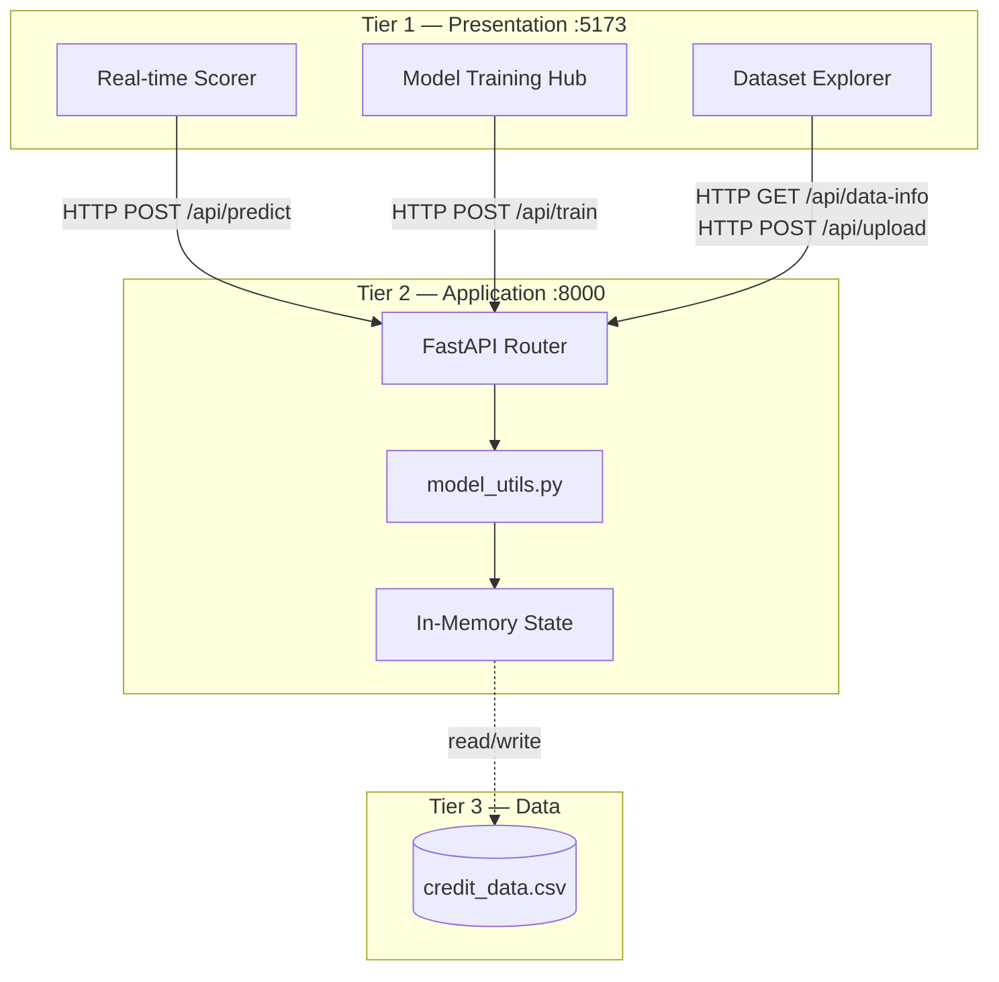
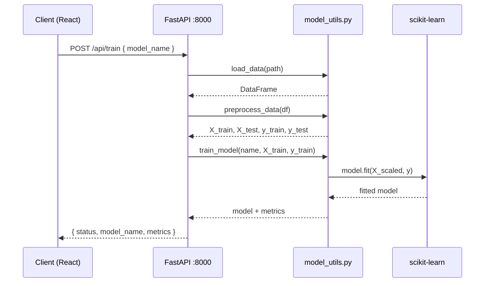
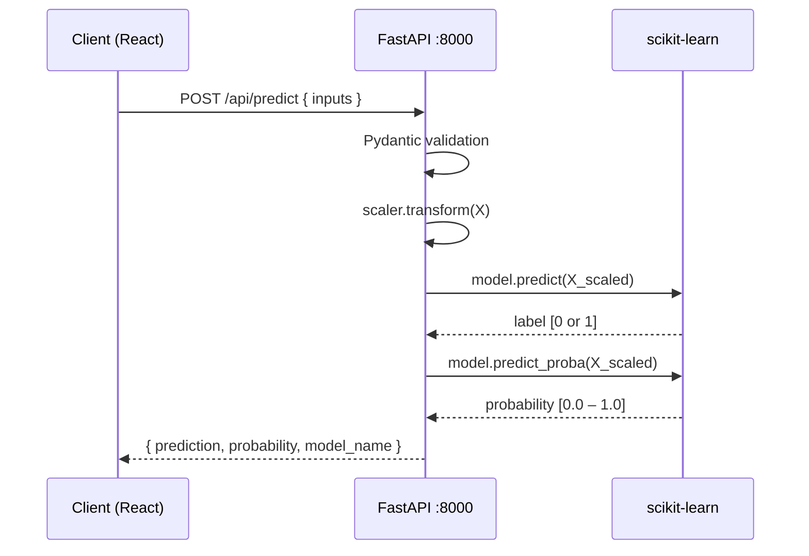
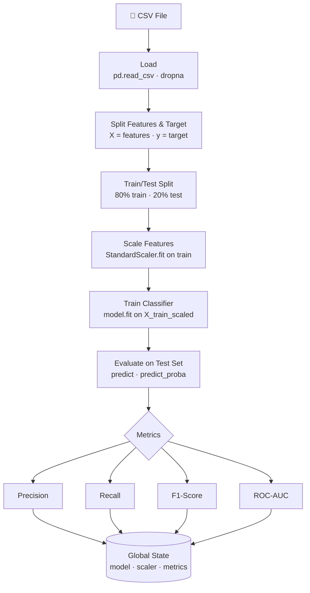
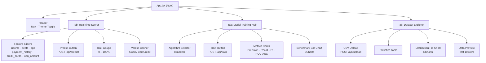
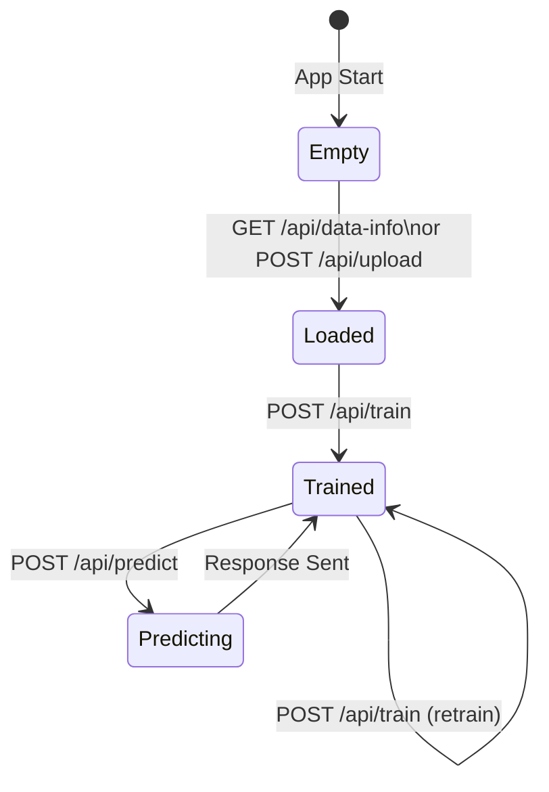
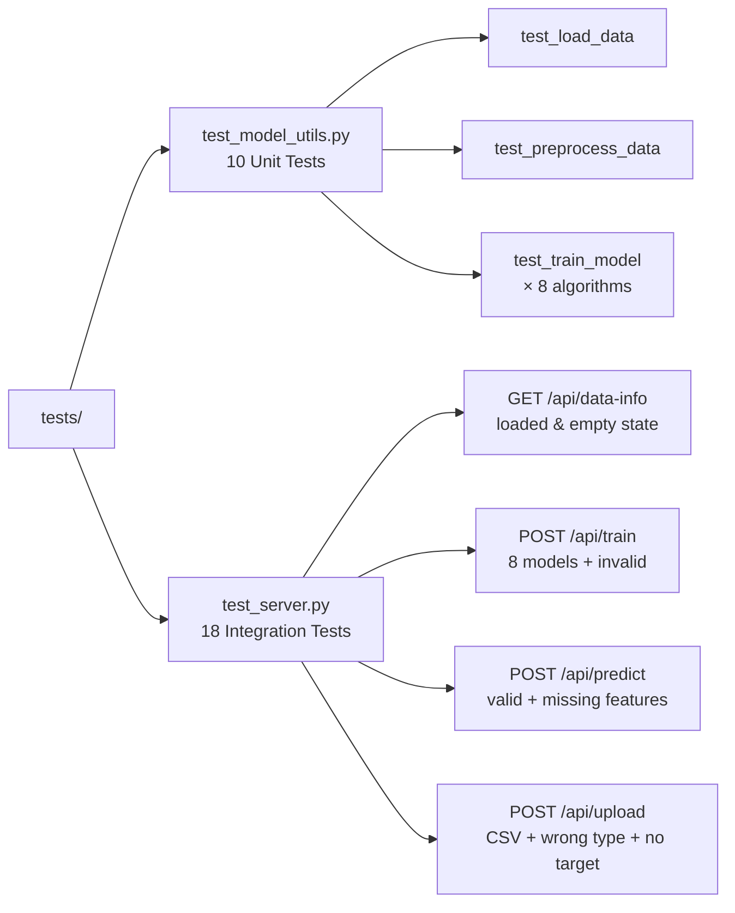

# 🏗️ Architecture & Design Document

> Technical deep-dive into the design, data flow, ML pipeline, and component structure of the Credit Risk Analytics Platform.

---

## 📋 Table of Contents

| Section | Description |
|---------|-------------|
| [🧱 High-Level Architecture](#-high-level-architecture) | Three-tier system overview |
| [🔁 Request Lifecycle](#-request-lifecycle) | Training & prediction flows |
| [🧬 ML Pipeline](#-ml-pipeline) | Step-by-step ML process |
| [🖥️ Frontend Components](#️-frontend-component-tree) | React component hierarchy |
| [💾 State Management](#-backend-state-management) | Global state design |
| [🔒 Security Model](#-security-model) | Threats and mitigations |
| [📦 Dependencies](#-dependency-overview) | All packages explained |
| [🧪 Test Architecture](#-test-architecture) | Test structure and coverage |
| [🚧 Future Improvements](#-future-improvements) | Roadmap |

---

## 🧱 High-Level Architecture

The platform uses a **Three-Tier Architecture**:



---

## 🔁 Request Lifecycle

### Training Flow



### Prediction Flow



---

## 🧬 ML Pipeline



### Algorithm Parameters

| Algorithm | Key Parameters |
|-----------|---------------|
| Logistic Regression | `max_iter=1000` |
| Decision Tree | `random_state=42` |
| Random Forest | `n_estimators=100`, `random_state=42` |
| Gradient Boosting | `n_estimators=100`, `random_state=42` |
| AdaBoost | `n_estimators=100`, `random_state=42` |
| K-Nearest Neighbors | `n_neighbors=5` |
| Naive Bayes | GaussianNB (defaults) |
| SVM | `probability=True`, `random_state=42` |

---

## 🖥️ Frontend Component Tree



---

## 💾 Backend State Management

The backend uses a **global in-memory dictionary** shared across all requests:

```python
state = {
    "df":           None,   # Active Pandas DataFrame
    "model":        None,   # Fitted scikit-learn classifier
    "scaler":       None,   # Fitted StandardScaler instance
    "feature_cols": [],     # List of input feature column names
    "model_name":   None,   # Name of the currently active model
    "metrics":      {}      # Last evaluation: Precision, Recall, F1, ROC-AUC
}
```

### State Lifecycle



> **Note:** Single-user, single-session design. For production, use a model registry (e.g. MLflow) or database-backed session store.

---

## 🔒 Security Model

| Threat | Mitigation |
|--------|-----------|
| Secrets in source code | All config in `.env` — excluded via `.gitignore` |
| Cross-origin attacks | CORS restricted via `ALLOWED_ORIGINS` env variable |
| Malformed inputs | Pydantic models enforce types and ranges at API boundary |
| Malicious CSV files | Only `text/csv` MIME accepted; parsed safely with pandas |
| JSON serialization | All NumPy types cast to native Python before response |
| Exposed internal files | `.dockerignore`, `.gitignore`, `.env.*` — never pushed |

---

## 📦 Dependency Overview

### Backend (`requirements.txt`)

| Package | Version | Purpose |
|---------|:-------:|---------|
| `fastapi` | 0.137 | REST API framework |
| `uvicorn` | 0.49 | ASGI server |
| `pydantic` | 2.x | Request/response validation |
| `pandas` | 3.x | DataFrame operations |
| `numpy` | 2.x | Numerical computing |
| `scikit-learn` | 1.9 | ML algorithms & evaluation |
| `python-multipart` | 0.0.x | File upload parsing |
| `httpx` | 0.28 | Async HTTP client for tests |
| `pytest` | 9.x | Test runner |

### Frontend (`package.json`)

| Package | Purpose |
|---------|---------|
| `react` | UI component library |
| `react-dom` | DOM rendering |
| `vite` | Dev server & bundler |
| `echarts` | Chart visualizations |
| `axios` | HTTP client |
| `lucide-react` | SVG icon set |

---

## 🧪 Test Architecture



### Running Tests

```bash
# Full suite
python -m pytest

# With verbose output
python -m pytest -v

# Specific file
python -m pytest tests/test_server.py -v
```

---

## 🚧 Future Improvements

| Priority | Improvement | Effort | Impact |
|:--------:|-------------|:------:|:------:|
| 🔴 High | Persistent model storage (joblib) | Medium | High |
| 🔴 High | User authentication (JWT / OAuth2) | High | High |
| 🟡 Medium | SHAP explainability in predictions | Medium | Medium |
| 🟡 Medium | PostgreSQL for multi-session support | High | High |
| 🟢 Low | Docker Compose one-command setup | Low | Medium |
| 🟢 Low | Hyperparameter tuning UI (GridSearch) | Medium | Medium |
| 🟢 Low | Export trained model as `.pkl` download | Low | Low |

---

*Last updated: June 2026 · [← Back to README](./README.md)*
