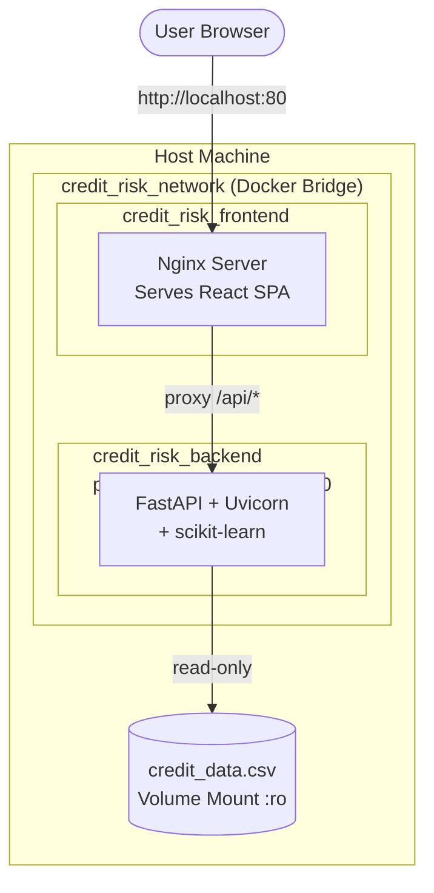

# 🐳 Docker Setup Guide

> Complete guide to install Docker and run the Credit Risk Analytics Platform as containers — no Python or Node.js required on your machine.

---

## 📋 Table of Contents

| Section | Description |
|---------|-------------|
| [Install Docker](#-install-docker) | Install on Windows, macOS, Linux |
| [Verify Installation](#-verify-installation) | Confirm Docker is working |
| [Run the Platform](#-run-the-platform) | Clone and start with one command |
| [Environment Variables](#-environment-variables) | Configure secrets for Docker |
| [Useful Commands](#-useful-docker-commands) | Manage containers |
| [Troubleshooting](#-troubleshooting) | Fix common issues |
| [Architecture](#-docker-architecture) | How containers connect |

---

## 🖥️ Install Docker

### Windows

1. Download **Docker Desktop for Windows** from the official site:
   👉 https://www.docker.com/products/docker-desktop/

2. Run the installer (`Docker Desktop Installer.exe`)

3. During setup, ensure **WSL 2** is selected (recommended)

4. After installation, restart your computer

5. Open **Docker Desktop** from the Start Menu and wait for it to start

> **Requirements:** Windows 10/11 (64-bit), WSL 2 enabled, 4 GB RAM minimum

---

### macOS

1. Download **Docker Desktop for Mac**:
   👉 https://www.docker.com/products/docker-desktop/

2. Choose the correct chip version:
   - **Apple Silicon (M1/M2/M3):** Download for Apple Silicon
   - **Intel:** Download for Intel

3. Open the downloaded `.dmg` file and drag Docker to Applications

4. Launch **Docker** from Applications and follow the setup prompts

> **Requirements:** macOS 12 or later, 4 GB RAM minimum

---

### Linux (Ubuntu / Debian)

Run these commands in your terminal:

```bash
# Step 1: Update package index
sudo apt-get update

# Step 2: Install required packages
sudo apt-get install -y ca-certificates curl gnupg

# Step 3: Add Docker's official GPG key
sudo install -m 0755 -d /etc/apt/keyrings
curl -fsSL https://download.docker.com/linux/ubuntu/gpg | \
  sudo gpg --dearmor -o /etc/apt/keyrings/docker.gpg
sudo chmod a+r /etc/apt/keyrings/docker.gpg

# Step 4: Add Docker repository
echo \
  "deb [arch=$(dpkg --print-architecture) signed-by=/etc/apt/keyrings/docker.gpg] \
  https://download.docker.com/linux/ubuntu \
  $(. /etc/os-release && echo "$VERSION_CODENAME") stable" | \
  sudo tee /etc/apt/sources.list.d/docker.list > /dev/null

# Step 5: Install Docker Engine + Compose
sudo apt-get update
sudo apt-get install -y docker-ce docker-ce-cli containerd.io docker-compose-plugin

# Step 6: Allow running Docker without sudo
sudo usermod -aG docker $USER
newgrp docker
```

---

## ✅ Verify Installation

After installing Docker, confirm it's working:

```bash
# Check Docker version
docker --version
# Expected: Docker version 25.x.x or later

# Check Docker Compose version
docker compose version
# Expected: Docker Compose version v2.x.x or later

# Test with hello-world container
docker run hello-world
# Expected: "Hello from Docker!"
```

---

## 🚀 Run the Platform

Once Docker is installed, run the full platform with:

```bash
# Step 1: Clone the repository
git clone https://github.com/chandru-collab/Credit-Risk-Analytics-Platform.git
cd Credit-Risk-Analytics-Platform

# Step 2: Build and start both services
docker compose up --build
```

Wait for both services to be ready:

```
✅ credit_risk_backend   → http://localhost:8000
✅ credit_risk_frontend  → http://localhost:80
```

**Open the app:** http://localhost

---

## ⚙️ Environment Variables

By default, Docker Compose uses values defined in `docker-compose.yml`. To override them, create a `.env` file in the project root:

```bash
# Create env file
copy .env.example .env    # Windows
cp .env.example .env      # macOS / Linux
```

Edit `.env`:

```env
HOST=0.0.0.0
PORT=8000
ALLOWED_ORIGINS=http://localhost,http://localhost:80
DEFAULT_DATASET_PATH=credit_data.csv
DEFAULT_MODEL=Random Forest
```

Then rebuild to apply changes:

```bash
docker compose up --build
```

---

## 🛠️ Useful Docker Commands

### Start / Stop

```bash
# Start in foreground (see logs)
docker compose up

# Start in background (detached)
docker compose up -d

# Stop all services
docker compose down

# Stop and remove volumes
docker compose down -v
```

### Build

```bash
# Rebuild images (after code changes)
docker compose up --build

# Rebuild a specific service only
docker compose build backend
docker compose build frontend
```

### Logs

```bash
# View logs for all services
docker compose logs

# Follow logs in real-time
docker compose logs -f

# Logs for a specific service
docker compose logs -f backend
docker compose logs -f frontend
```

### Status & Inspection

```bash
# List running containers
docker compose ps

# Inspect backend container
docker inspect credit_risk_backend

# Open a shell inside the backend container
docker exec -it credit_risk_backend bash

# Check resource usage
docker stats
```

### Cleanup

```bash
# Remove stopped containers
docker compose rm

# Remove all unused images, containers, networks
docker system prune

# Remove everything including volumes (⚠️ destructive)
docker system prune -a --volumes
```

---

## 🔧 Troubleshooting

### Port Already in Use

```
Error: bind: address already in use
```

**Fix:** Stop the process using the port:

```bash
# Find process on port 8000
# Windows:
netstat -ano | findstr :8000

# macOS / Linux:
lsof -i :8000
kill -9 <PID>
```

Or change the port in `docker-compose.yml`:

```yaml
ports:
  - "8080:8000"   # Change 8000 to any free port
```

---

### Backend Health Check Failing

```
Error: container credit_risk_backend is unhealthy
```

**Fix:** Check backend logs for startup errors:

```bash
docker compose logs backend
```

Common causes:
- Missing `credit_data.csv` file
- `requirements.txt` install failure
- Port conflict inside container

---

### Frontend Cannot Reach Backend

The frontend Nginx proxies `/api/` requests to the backend service name `backend` (defined in `docker-compose.yml`). If you renamed services, update `nginx.conf`:

```nginx
location /api/ {
    proxy_pass http://backend:8000;   # Must match service name
}
```

---

### Docker Daemon Not Running

```
Error: Cannot connect to the Docker daemon
```

**Fix:**
- **Windows/macOS:** Open Docker Desktop and wait for it to start (whale icon in taskbar)
- **Linux:** Start the service:

```bash
sudo systemctl start docker
sudo systemctl enable docker   # Auto-start on boot
```

---

### Permission Denied (Linux)

```
permission denied while trying to connect to the Docker daemon socket
```

**Fix:**

```bash
sudo usermod -aG docker $USER
newgrp docker
```

Then log out and log back in.

---

## 🏗️ Docker Architecture



### Container Summary

| Container | Base Image | Port | Role |
|-----------|-----------|:----:|------|
| `credit_risk_frontend` | `nginx:alpine` | 80 | Serves React SPA, proxies API calls |
| `credit_risk_backend` | `python:3.12-slim` | 8000 | FastAPI + all ML algorithms |

---

## 📦 Image Sizes (Approximate)

| Image | Size |
|-------|------|
| Backend (multi-stage) | ~450 MB |
| Frontend (Nginx) | ~30 MB |

---

*Last updated: June 2026 · [← Back to README](./README.md)*
