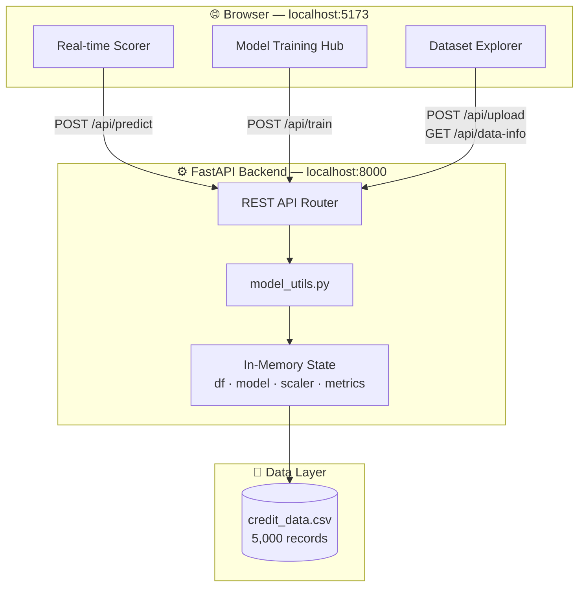
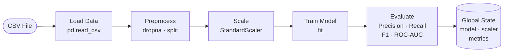
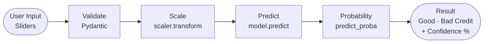

# 🏦 Credit Risk Analytics & Simulation Platform

> A production-ready platform that evaluates borrower creditworthiness in real-time using **8 Machine Learning algorithms**, interactive dashboards, and live risk scoring.

<p align="center">
  
  
  
  
  
  
  
</p>

---

## 📋 Table of Contents

| Section | Description |
|---------|-------------|
| [✨ Features](#-features) | What the platform can do |
| [🏗️ System Architecture](#️-system-architecture) | How the components connect |
| [🔁 Data Flow](#-data-flow) | Training & prediction lifecycle |
| [📊 ML Models](#-ml-models--benchmarks) | Algorithms and performance |
| [📁 Dataset](#-dataset-overview) | Feature descriptions |
| [🚀 Getting Started](#-getting-started) | Clone, setup, and run |
| [🐳 Docker Setup](#-docker-setup) | Run with one command |
| [📂 Project Structure](#-project-structure) | File organization |
| [🔌 API Reference](#-api-reference) | Endpoints and examples |
| [🧪 Testing](#-testing) | Test suite details |
| [🛠️ Tech Stack](#️-tech-stack) | All dependencies |

---

## ✨ Features

| Feature | Description |
|---------|-------------|
| 🤖 **8 ML Algorithms** | Train & compare models interactively |
| ⚡ **Real-time Scoring** | Instant credit prediction with probability |
| 📂 **CSV Upload** | Bring your own dataset and auto-train |
| 📊 **Benchmark Charts** | Visual side-by-side model comparison |
| 🌗 **Dark / Light Mode** | Full theme toggle support |
| 🧪 **28 Automated Tests** | 100% passing — model + API coverage |
| 🐳 **Docker Ready** | One-command deployment |
| 🔒 **Secrets Management** | `.env`-based config, never committed |

---

## 🏗️ System Architecture



---

## 🔁 Data Flow

### Training Pipeline



### Prediction Pipeline



---

## 📊 ML Models & Benchmarks

### Supported Algorithms

| # | Algorithm | Type | Speed | Best For |
|:-:|-----------|------|:-----:|----------|
| 1 | Logistic Regression | Linear | ⚡⚡⚡ | Baseline, linear data |
| 2 | Decision Tree | Tree-based | ⚡⚡⚡ | Interpretable rules |
| 3 | Random Forest | Ensemble | ⚡⚡ | General purpose |
| 4 | Gradient Boosting | Ensemble | ⚡ | Highest accuracy |
| 5 | AdaBoost | Ensemble | ⚡⚡ | Low-noise datasets |
| 6 | K-Nearest Neighbors | Instance-based | ⚡ | Small datasets |
| 7 | Naive Bayes | Probabilistic | ⚡⚡⚡ | Quick baseline |
| 8 | Support Vector Machine | Kernel-based | ⚡ | High-dimensional |

### Performance Benchmark

| Rank | Algorithm | Precision | Recall | F1-Score | ROC-AUC |
|:----:|-----------|:---------:|:------:|:--------:|:-------:|
| 🥇 | Gradient Boosting | **0.87** | **0.85** | **0.86** | **0.93** |
| 🥈 | Random Forest | 0.86 | 0.84 | 0.85 | 0.92 |
| 🥉 | SVM | 0.85 | 0.82 | 0.83 | 0.91 |
| 4 | AdaBoost | 0.84 | 0.83 | 0.83 | 0.90 |
| 5 | Logistic Regression | 0.82 | 0.79 | 0.80 | 0.88 |
| 6 | Naive Bayes | 0.80 | 0.74 | 0.77 | 0.85 |
| 7 | KNN | 0.79 | 0.77 | 0.78 | 0.82 |
| 8 | Decision Tree | 0.76 | 0.78 | 0.77 | 0.77 |

---

## 📁 Dataset Overview

| Feature | Type | Range | Description |
|---------|------|-------|-------------|
| `income` | Continuous | 20K – 120K | Annual income in USD |
| `debts` | Continuous | 1K – 48K | Total outstanding debts |
| `payment_history` | Ordinal | 0 – 5 | Past payment behavior score |
| `age` | Discrete | 18 – 70 | Borrower age |
| `credit_cards` | Discrete | 0 – 5 | Number of active credit cards |
| `loan_amount` | Continuous | 2K – 57K | Requested loan amount |
| `target` | Binary | 0 / 1 | `0` = Bad Credit · `1` = Good Credit |

> **5,000 total records** · 80% training split · 20% test split

---

## 🚀 Getting Started

### Prerequisites

| Tool | Minimum Version |
|------|----------------|
| Python | 3.10+ |
| Node.js | 18+ |
| npm | 9+ |
| Git | Any |

### Step 1 — Clone the Repository

```bash
git clone https://github.com/chandru-collab/Credit-Risk-Analytics-Platform.git
cd Credit-Risk-Analytics-Platform
```

### Step 2 — Backend Setup

```bash
# Create virtual environment
python -m venv .venv

# Activate — Windows
.venv\Scripts\activate

# Activate — macOS / Linux
source .venv/bin/activate

# Install Python dependencies
pip install -r requirements.txt
```

### Step 3 — Configure Environment

```bash
# Windows
copy .env.example .env

# macOS / Linux
cp .env.example .env
```

Open `.env` and set your values:

```env
HOST=127.0.0.1
PORT=8000
ALLOWED_ORIGINS=http://localhost:5173
DEFAULT_DATASET_PATH=credit_data.csv
DEFAULT_MODEL=Random Forest
```

### Step 4 — Start the Backend

```bash
python server.py
# ✅ Uvicorn running on http://127.0.0.1:8000
```

### Step 5 — Start the Frontend

```bash
cd frontend
npm install
npm run dev
# ✅ VITE ready → http://localhost:5173
```

### Step 6 — Open the App

```
http://localhost:5173
```

---

## 🐳 Docker Setup

> 📖 **Full Docker guide:** [DOCKER.md](./DOCKER.md) — includes installation instructions for Windows, macOS, and Linux.

### Install Docker

| OS | Link |
|----|------|
| Windows | https://www.docker.com/products/docker-desktop/ |
| macOS | https://www.docker.com/products/docker-desktop/ |
| Linux | `sudo apt-get install docker-ce docker-compose-plugin` |

### Run with One Command

```bash
# Clone the repo
git clone https://github.com/chandru-collab/Credit-Risk-Analytics-Platform.git
cd Credit-Risk-Analytics-Platform

# Build and start both services
docker compose up --build
```

| Service | URL |
|---------|-----|
| Frontend | http://localhost |
| Backend API | http://localhost:8000 |
| API Docs | http://localhost:8000/docs |

```bash
# Run in background
docker compose up -d

# View logs
docker compose logs -f

# Stop all services
docker compose down
```

> See [DOCKER.md](./DOCKER.md) for environment config, troubleshooting, and all Docker commands.

---

## 📂 Project Structure

```
Credit-Risk-Analytics-Platform/
│
├── server.py                    ← FastAPI app & all API endpoints
├── model_utils.py               ← ML preprocessing & training logic
├── credit_data.csv              ← Default dataset (5,000 records)
├── requirements.txt             ← Python dependencies
├── Dockerfile                   ← Backend container definition
├── docker-compose.yml           ← Multi-service orchestration
│
├── tests/
│   ├── test_model_utils.py      ← Unit tests — ML logic (10 tests)
│   └── test_server.py           ← Integration tests — API (18 tests)
│
└── frontend/
    ├── Dockerfile               ← Frontend container (Nginx)
    ├── nginx.conf               ← Nginx SPA + API proxy config
    ├── index.html               ← HTML entry point
    ├── package.json             ← Node dependencies & scripts
    ├── vite.config.js           ← Vite configuration
    └── src/
        ├── main.jsx             ← React entry point
        ├── App.jsx              ← Main application component
        ├── App.css              ← Component styles
        └── index.css            ← Global design system
```

---

## 🔌 API Reference

| Method | Endpoint | Description |
|--------|----------|-------------|
| `GET` | `/` | Health check |
| `GET` | `/api/data-info` | Dataset stats + model metrics |
| `POST` | `/api/train` | Train a selected ML model |
| `POST` | `/api/predict` | Predict credit risk for input |
| `POST` | `/api/upload` | Upload CSV and auto-train |

### Train a Model

```bash
curl -X POST http://localhost:8000/api/train \
  -H "Content-Type: application/json" \
  -d '{"model_name": "Gradient Boosting"}'
```

```json
{
  "status": "success",
  "model_name": "Gradient Boosting",
  "metrics": {
    "Precision": 0.871,
    "Recall": 0.853,
    "F1-Score": 0.862,
    "ROC-AUC": 0.934
  }
}
```

### Run a Prediction

```bash
curl -X POST http://localhost:8000/api/predict \
  -H "Content-Type: application/json" \
  -d '{
    "inputs": {
      "income": 85000,
      "debts": 12000,
      "payment_history": 4,
      "age": 35,
      "credit_cards": 2,
      "loan_amount": 25000
    }
  }'
```

```json
{
  "prediction": 1,
  "probability": 0.892,
  "model_name": "Gradient Boosting"
}
```

---

## 🧪 Testing

```bash
# Run full test suite (28 tests)
python -m pytest

# Verbose output with test names
python -m pytest -v

# Run specific test file
python -m pytest tests/test_model_utils.py -v
python -m pytest tests/test_server.py -v
```

### Test Coverage Summary

| Test File | Tests | What It Covers |
|-----------|:-----:|----------------|
| `test_model_utils.py` | 10 | Data loading, preprocessing, all 8 algorithm trains |
| `test_server.py` | 18 | All endpoints, edge cases, error handling |
| **Total** | **28** | **100% passing ✅** |

---

## 🛠️ Tech Stack

### Backend

| Package | Version | Purpose |
|---------|:-------:|---------|
| Python | 3.12 | Core language |
| FastAPI | 0.137 | REST API framework |
| Uvicorn | 0.49 | ASGI server |
| scikit-learn | 1.9 | ML algorithms & evaluation |
| Pandas | 3.x | DataFrame operations |
| NumPy | 2.x | Numerical computing |
| Pydantic | 2.x | Request validation |
| pytest + httpx | 9.x / 0.28 | Test framework & HTTP client |

### Frontend

| Package | Purpose |
|---------|---------|
| React 18 | UI component library |
| Vite 8 | Build tool & dev server |
| ECharts | Charts & visualizations |
| Axios | HTTP client |
| Lucide React | SVG icon set |

---

## 📄 License

This project is licensed under the **MIT License**.

---

<p align="center">
  Built with ❤️ using Python · FastAPI · React · scikit-learn
  <br/><br/>
  ⭐ <strong>Star this repo if you found it useful!</strong>
</p>
